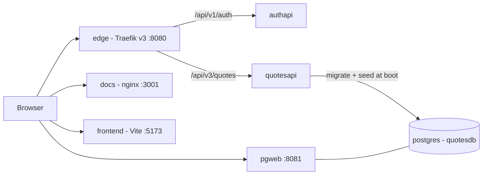
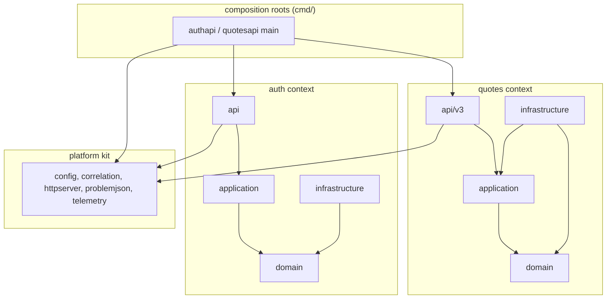

# Architecture

This page states the **rules** of the port: what runs where, how the layers may depend
on each other, and how the wire contracts are owned. The end-to-end map — including CI —
is [system design](system-design.md); the decisions behind each rule are the
[ADRs](architecture-decisions.md); each component's detail lives in the readme next to
its source.

> Links from this Docsify site into repository paths (`../cmd/...`, `../internal/...`)
> resolve on GitHub; Docsify serves the `docs/` folder only.

## Topology

The compose file is both the dev stack and the publish artifact (ADR 0001) — the .NET
original's Aspire AppHost expressed in the engine-neutral compose spec, so the same file
runs under docker compose (CI) and podman compose (laptops). The edge is Traefik v3 with
the file provider: no docker labels, no engine socket, one watched route table
(`traefik/dynamic.yml`).

Only two routes exist (`PathPrefix` semantics — the APIs see the request path exactly as
the SPA emits it):

| Route | Service | Notes |
|-------|---------|-------|
| `/api/v1/auth` | authapi | login + introspection |
| `/api/v3/quotes` | quotesapi | the proto transport |

`authapi` owns no database; `quotesapi` never calls authapi on the request path — it
validates tokens locally with the shared HS256 key (`JWT__SIGNINGKEY`, one value for both
sides; see [dev credentials](dev-credentials.md)). Healthchecks + `depends_on` replace
Aspire's `WaitFor`, and the quotesapi boot additionally retries database connects itself
because podman-compose's conditional ordering has bug history.

Profiles: unprofiled = core (postgres + both APIs + edge); `dev` adds the docs server
(:3001) and pgweb (:8081); `fullstack` adds the Vite dev server (:5173), its proxy
pointing at the edge so the browser story is one origin. `scripts/start.sh` drives the
selection.

## Layering

Two bounded contexts (quotes, auth) plus a platform kit, each context with the same four
layers — the .NET Clean Architecture shape. Dependencies point one way only, and the
rules are code, not aspiration: the depguard section of `.golangci.yml` (ADR 0009) fails
lint on any violation, mirroring the .NET repo's NetArchTest table.

The rules that matter:

1. **Domain imports nothing** — not upper layers, not the other context, not the
   platform. The standard library only.
2. **Application** depends on its own domain; never infrastructure, api, the other
   context or the platform kit (the platform is composed at the edges).
3. **Infrastructure** implements the domain's ports; it may never reach up into api.
4. **Bounded contexts meet in transport or composition, never below** — quotesapi's
   `bearerAuthenticator` (in `cmd/quotesapi`) is the sanctioned meeting point: it adapts
   the auth context's validator onto the v3 transport's `Authenticator` port.
5. **Platform is a leaf** others compose; it may not depend on either context.

Per-layer ownership and the readmes: [internal/quotes](../internal/quotes/README.md),
[internal/auth](../internal/auth/README.md), [internal/platform](../internal/platform/README.md).

## The transport rule (v3)

The proto file is the single contract of record: every route comes from its
`google.api.http` rules via the grpc-gateway runtime — **no hand-written routing exists**
in this transport. The gateway knobs that pin the wire semantics (the JSONPb marshaler
that keeps `"details":[]` in every error body, the correlation header matchers, the
stock error handler that produces the `{"code","message","details"}` envelope and the
gRPC→HTTP status table) are enumerated in [ADR 0002](adr/0002-v3-transport-grpc-gateway.md)
and set in one place, `NewGatewayMux`.

Authentication and authorization run **before** the gateway (the `RequireScope`
middleware): the 401 problem+json with `WWW-Authenticate` and the empty-body 403 are
answered there, byte-identical to the .NET pipeline, and never surface through the
gateway's error handler. A grpc-side interceptor enforces the same method→scope table
for any caller that dials the loopback listener directly — defense in depth, not the
wire path.

## Configuration and errors

Configuration is Viper with typed structs and `__` env-name parity with the .NET kit
(`JWT__SIGNINGKEY`, `CONNECTIONSTRINGS__QUOTESDB`, `SERVER__ADDRESS`), validated
fail-fast at boot (ADR 0004). Expected failures are `*domain.Error` values with stable
codes; the two transports map them differently on purpose — problem+json on auth (and on
the quotes transport's pre-gateway 401/403), the gRPC status envelope on the v3 surface
(ADR 0006). Both envelopes are single-sourced: `problemjson` for problems, the gateway's
error handler for statuses.

## Observability and data

Logging is slog JSON, telemetry is OpenTelemetry on only when
`OTEL_EXPORTER_OTLP_ENDPOINT` is set (ADR 0005) — [observability](observability.md).
The catalog is PostgreSQL behind sqlc + pgx + golang-migrate with migration-at-boot
(ADR 0007) — [data storage](data-storage.md).
