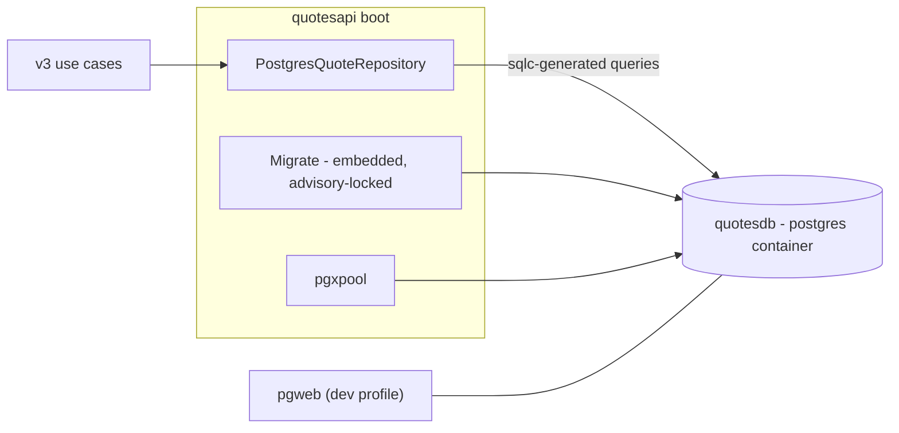

# Data storage

How the quotes catalog is stored, migrated and seeded — and why every boot sees the
same eight quotes. The decision record is [ADR 0007](adr/0007-persistence-sqlc-pgx-migrate.md);
the adapter lives in [internal/quotes/infrastructure](../internal/quotes/infrastructure/).

## The shape

The catalog is a compose service, volume-less on purpose: `quotesapi` migrates and seeds
at boot, so every `./scripts/start.sh` is a deterministic from-scratch catalog — the
property the BDD and e2e suites assert on. The throwaway e2e catalog
(`scripts/e2e.sh`) is the same migration against a standalone container started from
`scripts/e2e.env`.

## The pipeline: sqlc + pgx + golang-migrate

- **Schema**: `internal/quotes/infrastructure/migrations/0001_initial.up.sql` — hand-written
  SQL, the .NET repo's
  initial migration mirrored column-for-column (snake_case), with the eight seed rows
  verbatim (ids `"1"`–`"8"`, fixed `2024-01-01T00:00:00Z` timestamps so they sort first).
- **Queries**: `internal/quotes/infrastructure/queries.sql` — the repository's
  statements as reviewed SQL; `sqlc.yaml` compiles them into the committed Go code in
  `internal/quotes/infrastructure/db` (regenerate with sqlc v1.31.1). SQL is the
  reviewed artifact, the Go is build output.
- **Connections**: pgx/v5 through a pool (`NewPool`); the connection string arrives as
  `CONNECTIONSTRINGS__QUOTESDB` (Viper's `__` parity — the same env name the .NET kit
  reads).
- **Migration at boot**: `Migrate` applies the embedded migrations — idempotent, and
  serialized across replicas by golang-migrate's schema_migrations advisory lock. No
  environment exists in which a human runs a migration step. The boot retries connection
  failures for a bounded budget (the compose `depends_on` ordering is a convenience,
  not a correctness requirement on podman).

## The unique-fingerprint rule

Near-duplicate detection is a **constraint, not a discipline**. The domain computes a
normalized fingerprint (`Fingerprint` — lowercase, alphanumeric-collapsed text) and the table carries `CREATE UNIQUE INDEX quotes_normalized_fingerprint_key` over
it. The repository's `Add` maps the unique-index violation onto the
`QuoteDuplicateFingerprint` outcome — callers never race an existence check against an
insert, and the application's create use case translates that outcome into the
`quote.duplicate_fingerprint` failure (a 409-class AlreadyExists on the v3 wire).

## Health: the round-trip, not the pool

`GET /health` on quotesapi answers readiness by proving the database actually answers a
`SELECT 1` round-trip (`Ping`), within a 5-second budget — not that a warm pool holds an
idle connection. A paused database would pass the weaker check and still be down. The
budget is a select guard rather than a context deadline because a socket frozen
mid-read can ignore cooperative cancellation, and readiness must answer regardless.

## Where each value lives

| Value | Where it is defined |
|-------|---------------------|
| Compose catalog credentials | `docker-compose.yaml` (development values: user/password/database `quotes`) |
| Throwaway e2e catalog values | `scripts/e2e.env` — the one copy shared by the script and the CI job |
| Image tags (postgres et al.) | `scripts/images.env`, cross-checked against the compose file by the `image-pins` CI job |

Real credentials never appear in either place — see
[dev credentials](dev-credentials.md) for the consolidation rule the `secrets-hygiene`
job enforces.
