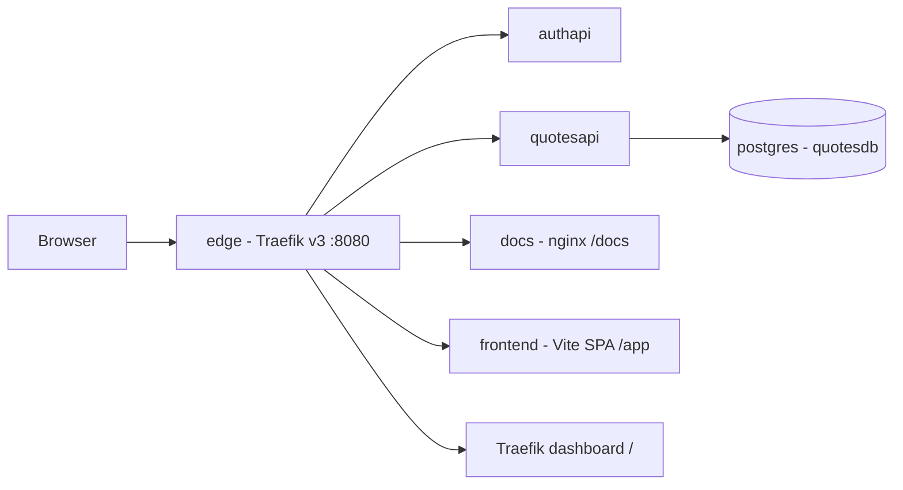
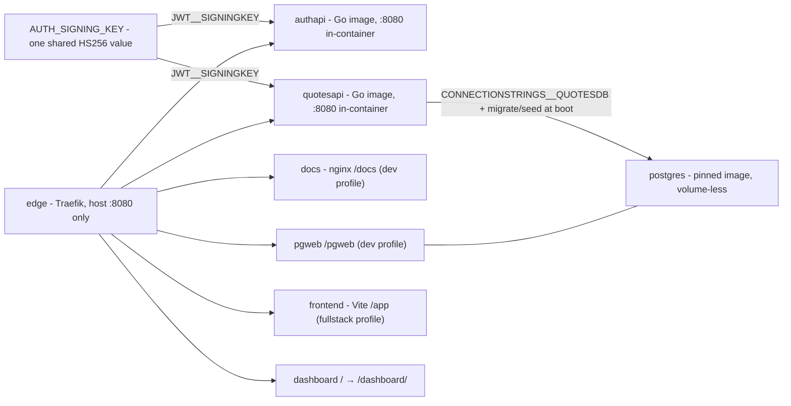
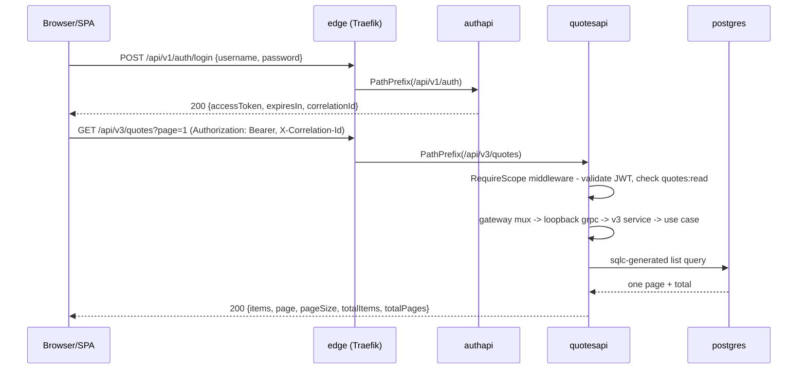

# System design

A single view of the whole system: what runs, how a request travels from the browser to
the catalog and back, and how the repository is built and shipped. This page is the
**map**; the **rules** live in [architecture](architecture.md) and the per-component
detail in a `README.md` next to each source tree.

> The component links below are repository paths (`../cmd/...`, `../internal/...`).
> They resolve on GitHub; in the Docsify site they 404 (Docsify serves `docs/` only).

## System context

Two bounded contexts, one edge, one database, one SPA. Traefik is the only published
host port; `/` opens the Traefik dashboard, and dev surfaces plus the SPA join by path
prefix (ADR 0010). `authapi` mints tokens; `quotesapi` validates them locally
(golang-jwt) and never calls back on the request path. The SPA is consumed as a pinned
git submodule — its own repository carries its tests and its lint gates; from this
checkout it runs in the fullstack profile and the e2e suite.

## Runtime topology

Three things carry the wiring:

- **One secret, two services.** The compose default of `AUTH_SIGNING_KEY` is a public
  local-development value (see [dev credentials](dev-credentials.md)); tokens minted by
  authapi must validate in quotesapi, so both receive it as `JWT__SIGNINGKEY` — Viper's
  `__` separator mapping onto `jwt.signingkey`.
- **The catalog is volume-less on purpose.** quotesapi migrates and seeds at boot
  ([data storage](data-storage.md)), so every stack up is the deterministic eight-quote
  catalog the specs assert on.
- **Healthchecks order the boot** (`depends_on: condition: service_healthy`), and the
  quotesapi boot additionally retries database connects itself for a bounded budget —
  the podman-compose caveat recorded in ADR 0001.

## Request lifecycle

One authenticated read, end to end:

Rejections happen at different layers by design: the 401/403 shapes before the gateway,
domain rejections (unknown id, invalid page, duplicate fingerprint) inside the service
as gRPC statuses that the gateway renders as `{"code","message","details"}` — the exact
table is on [API](api.md).

## CI

`.github/workflows/ci.yml` gates every job (except `conventions`, `secrets-hygiene` and
path detection itself) on the areas a PR touches — the `changes` job computes the
filters, the jobs consume the `run_*` outputs. Skips happen at the job level on purpose:
skipped check runs still satisfy branch protection, and the workflow still completes so
[merge-me](../.github/workflows/merge-me.yml) keeps firing. Pushes to `main`, the
`ci:full-build` label and CI-configuration edits force the full matrix.

| Job (check name) | Proves | Runs on |
|------------------|--------|---------|
| `conventions (branch names + commit messages)` | branch, commits, PR title rules | every PR and push, ungated |
| `secrets hygiene (credential literals stay in the allowlist)` | credential literals consolidated | every PR and push, ungated |
| `openapi contract drift` | the frozen document matches a hermetic rebuild | `contracts/**`, `docs/openapi/**`, `Dockerfile.build` |
| `container image pin drift` | compose/Dockerfiles quote `scripts/images.env` exactly | pin files + compose + API Dockerfiles |
| `docs (links + code references)` | every documented link/ref resolves | `docs/**`, the readmes, `contracts/*.md` |
| `build & test (race + coverage)` | the whole unit/wire/integration sweep, race on | backend changes, pins |
| `lint (golangci-lint)` | format + the depguard layering rules | backend changes |
| `security (CodeQL)` | static analysis of the Go module | backend changes |
| `specs (BDD against the compose stack)` | the 26 Gherkin journeys through the edge | backend changes, pins |
| `e2e (full-stack Playwright against the Go APIs)` | the SPA against real APIs + catalog | backend changes, frontend pointer, pins |

## The .NET→Go mapping

One row per replaced element — each row consolidates the mapping its ADR records; the
.NET side is [code.examples.net.quotes](https://github.com/josnelihurt/code.examples.net.quotes).

| .NET element | Go replacement | Where |
|--------------|----------------|-------|
| Aspire AppHost orchestration | docker-compose spec — dev stack and publish artifact in one file | [ADR 0001](adr/0001-orchestration-compose-traefik.md), `docker-compose.yaml` |
| YARP gateway | Traefik v3 file provider — same route table, watched live | [ADR 0001](adr/0001-orchestration-compose-traefik.md), `traefik/dynamic.yml` |
| EF Core (models + migrations + seed) | sqlc (SQL as the reviewed artifact) + pgx/v5 + golang-migrate, migration-at-boot | [ADR 0007](adr/0007-persistence-sqlc-pgx-migrate.md) |
| Minimal-API JSON + gRPC-JSON transcoding | grpc-go server + grpc-gateway v2 runtime over the same proto | [ADR 0002](adr/0002-v3-transport-grpc-gateway.md) |
| Serilog | `log/slog` JSON | [ADR 0005](adr/0005-observability.md) |
| OpenTelemetry (.NET) | otel-go + otel-contrib (matched core/contrib pair, no-op without endpoint) | [ADR 0005](adr/0005-observability.md) |
| JwtBearer + scope policies | golang-jwt/jwt/v5 validation + the `RequireScope` middleware | [ADR 0006](adr/0006-auth-and-errors.md) |
| ProblemDetails factory | `internal/platform/problemjson` — the single RFC 9457 envelope | [ADR 0006](adr/0006-auth-and-errors.md) |
| xUnit | the `testing` package (table tests, `t.Run`) | [ADR 0008](adr/0008-testing-strategy.md) |
| Shouldly / FluentAssertions | `testify` assert/require | [ADR 0008](adr/0008-testing-strategy.md) |
| NSubstitute | hand-written stubs (`stub_repository_test.go`, `stubs_test.go`) | [ADR 0008](adr/0008-testing-strategy.md) |
| Reqnroll | godog (same Gherkin features, ported wording) | [ADR 0008](adr/0008-testing-strategy.md) |
| Testcontainers (.NET) | testcontainers-go (fresh database per test) | [ADR 0008](adr/0008-testing-strategy.md) |
| Coverlet / OpenCover | `go test -coverprofile` (collected, never gated) | [ADR 0008](adr/0008-testing-strategy.md) |
| NetArchTest layering tests | golangci-lint depguard rules | [ADR 0009](adr/0009-lint-and-architecture-guard.md) |
| Scalar.AspNetCore | a static Scalar page + the embedded frozen document at `/openapi/v3.json` | [ADR 0002](adr/0002-v3-transport-grpc-gateway.md), `internal/quotes/api/v3/docs.go` |
| Docsify resource in the AppHost | the `docs` compose service (nginx, dev profile, `/docs` on the edge) | ADR 0001, ADR 0010, `docker-compose.yaml` |
| `Microsoft.Extensions.Configuration` | Viper with typed structs, `__` env parity | [ADR 0004](adr/0004-configuration-viper.md) |

## How this repository was built

The stack of ten pull requests this repository landed as — three cooperating agent
roles, one decision per layer, every level independently green — is documented in
[agentic workflow](agentic-workflow.md); the working agreements each layer followed are
[AGENTS.md](../AGENTS.md) and [contributing](contributing.md).
